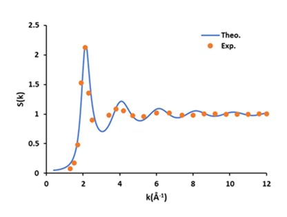
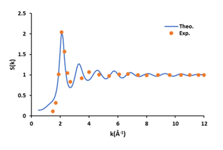
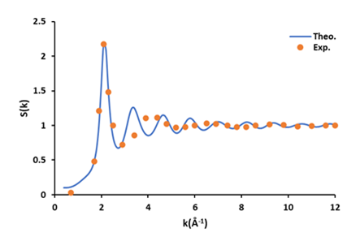
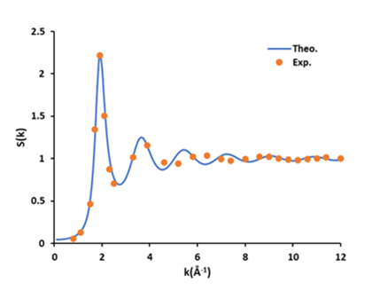
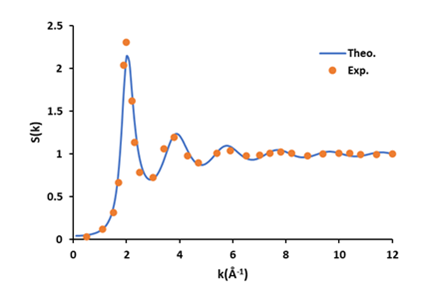

# MSc Dissertation: Liquid Metal Simulation

This repository contains the Fortran source code developed for my Master's dissertation at **Banaras Hindu University (BHU)**.
## 🔬 Theoretical Framework

This project investigates the acoustic properties of five rare-earth liquid metals: **Lanthanum (La), Cerium (Ce), Praseodymium (Pr), Europium (Eu), and Ytterbium (Yb)**. 

We employ the **Square Well (SW) Potential** under the **Mean Spherical Model Approximation (MSMA)** to solve the **Ornstein-Zernike (OZ) equation**

$$h(r) = c(r) + \rho \int c(|r-r'|) h(r') dr'$$

The sound velocity $\vartheta_s$ is determined using the isothermal compressibility $\beta_T$, derived from the long-wavelength limit of the structure factor $S(0)$:

$$S(0) = \rho K_B T \beta_T$$
$$\beta_T^{-1} = \rho_w \vartheta_s^2 \gamma^{-1}$$

## 📊 Key Results (at Melting Temperature)

| Metals | $S(0)$ | $\beta_T \times 10^{-11}$ ($m^2/N$) | Sound Velocity $\vartheta_s$ (m/s) |
| :--- | :---: | :---: | :---: |
| **Lanthanum** | 0.0429 | 9.68 | 1462.48 |
| **Cerium** | 0.1800 | 39.77 | 618.5 |
| **Praseodymium** | 0.1102 | 23.00 | 923.29 |
| **Europium** | 0.0415 | 14.92 | 1205.61 |
| **Ytterbium** | 0.0439 | 13.14 | 1164.47 |

### 📈 Computed Structure Factor S(k) vs. Experimental Data
These plots demonstrate the fair agreement between our theoretical SW model and available experimental results .

<p align="center">
  
  
  
  
  
</p>

## 📚 References

1. **Mishra, R.K., Lalneihpuii, R. & Pathak, R.**, *Chem. Phys.*, 2015, 457, 13-18.
2. **Lalneihpuii, R. et al.**, *J. Stat. Mech.*, 2019, 053202, 1-12.
3. **Waseda, Y.**, *The structure of non-crystalline materials*, 1980.
4. **Tang, Y. & Lu, B.C.Y.**, *Mol. Phys.*, 1995, 84, 89-103.

## 🚀 How to Run
To compile the code using `gfortran`:
```bash
gfortran MetalTest.for -o metal_sim
./metal_sim
